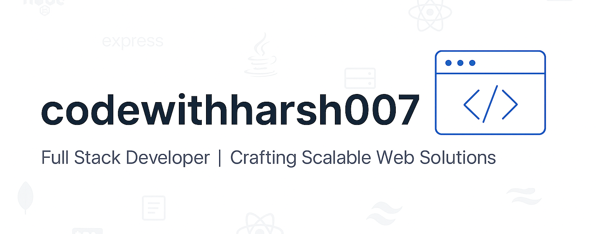

<!-- GitHub Profile README for codewithharsh007 -->

<!-- 👋 Typing Header Animation -->
<h1 align="center">
  
</h1>

  Full Stack Developer | Crafting Scalable Web Solutions  
   
  MERN Stack Enthusiast · Turning Ideas into Code

<!-- 🖼️ Banner -->

  

<!-- 👁️ Visitor Counter -->

  

---

### 👨‍💻 About Me

- 🚀 Full Stack Developer | Crafting Scalable Web Solutions  
- 🛠️ MERN Stack | REST APIs | Clean UI/UX with Tailwind CSS  
- 🧠 Always learning & building cool digital stuff  
- 🌐 Currently working on advanced resume-builder templates  
- 📫 Reach me at: **codewithharsh007@gmail.com**

---

### 🔗 Connect with Me

---

### 🛠️ Tech Stack

<!-- 🛠️ Tech Stack -->

  

---

### 📊 GitHub Stats

### 📊 GitHub Stats

  <picture>
    <source media="(max-width: 600px)" srcset="https://github-readme-stats.vercel.app/api?username=codewithharsh007&show_icons=true&theme=blueberry&hide_border=true&count_private=true&include_all_commits=true" />
    
  </picture>
  
   

  <picture>
    <source media="(max-width: 600px)" srcset="https://github-readme-streak-stats.herokuapp.com/?user=codewithharsh007&theme=blueberry&hide_border=true" />
    
  </picture>

---

### 📈 Contribution Graph

  

